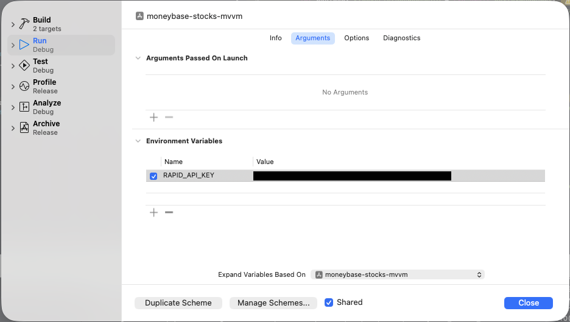

# moneybase-stocks-mvvm

iOS take-home project for the Moneybase interview process.

## Features

- Stocks list screen with symbol, name, price, and percentage change
- Stock detail screen with expanded company profile data
- Search by symbol or company name
- Auto-refresh every 8 seconds
- Infinite scroll with page-based loading
- Refresh CTA in the navigation bar when the list is scrolled away from the top
- Pull-to-refresh support
- MVVM-C architecture with Swift Concurrency
- Dependency Injection through a composition root
- Live RapidAPI integration (`yahoo-finance15`) with reusable request builder abstraction
- DTO-to-domain mapping layer for list and detail responses

### Refresh and Pagination UX

The stock list keeps the 8-second refresh requirement, but the app now trades a strict always-replace approach for a smoother user experience.

- When the user is at the top of the list, page 1 is refreshed automatically every 8 seconds.
- When the user scrolls deep into the list, the app shows a refresh button in the navigation bar instead of forcing the list to jump.
- Tapping the refresh button reloads page 1, resets pagination, and scrolls the list back to the top.
- Infinite scroll still loads the next pages as the user reaches the bottom of the list.

This keeps the data fresh while avoiding disruptive scroll jumps and unstable list reordering during reading.

## Architecture

The project follows a layered MVVM-C setup:

- `Domain`: entities, repository contracts, and use cases
- `Data`: remote repository, network stack, DTO models, and mock data support
- `Presentation`: SwiftUI views, view models, coordinators, and coordinator views
- `App`: dependency container and wiring

### Navigation with Coordinator Pattern

Navigation responsibilities are handled by coordinators instead of screen views:

- `StocksListCoordinator` manages list routes and pushes detail flow
- `StocksListCoordinatorView` hosts the navigation stack for list-related routes
- `StockDetailCoordinator` builds and owns detail screen dependencies
- `StockDetailCoordinatorView` renders the detail flow entry point

This keeps views focused on rendering and interaction, while routing remains in coordinator objects.

### Dependency Injection

The app uses a lightweight DI pattern via `AppDIContainer`.

- Build dependencies once at app launch
- Inject view models into views
- Inject coordinators into coordinator views
- Inject use cases into view models
- Inject repository into use cases

### Network stack

The networking layer now follows an `ApiBuilder` style design:

- `ApiBuilder`: centralizes `URLRequest` construction (scheme, host, path, headers, query, method)
- `YahooFinanceEndpoint`: endpoint enum that conforms to `ApiBuilder`
- `HTTPClient` + `URLSessionHTTPClient`: transport abstraction for testability
- `RemoteStocksRepository`: generic request execution + decoding, then maps DTOs to domain models
- `StocksListResponseDTO` and `StockProfileResponseDTO`: response parsing and domain mapping logic

### Current data source

The app currently uses a live network-backed repository by default:

- `RemoteStocksRepository` is wired in `AppDIContainer`
- Provider: RapidAPI host `yahoo-finance15.p.rapidapi.com`
- Endpoints used:
	- list: `/api/v2/markets/tickers`
	- detail: `/api/v1/markets/stock/modules`

Mock data support is still available by injecting a custom `StocksRepository` into `AppDIContainer` (useful for previews/tests).

#### API selection rationale

The interview task references the RapidAPI listing for `apidojo/yh-finance` and these endpoints:

- `market/v2/get-summary` for list data
- `stock/v2/get-summary` for detail data

During implementation, that listing was not available from the current RapidAPI account/portal view, while another Yahoo Finance listing was accessible:

- [`sparior/yahoo-finance15`](https://rapidapi.com/sparior/api/yahoo-finance15/playground/apiendpoint_18b0e0c0-9451-4592-9aa5-c1170ea15601) (host: `yahoo-finance15.p.rapidapi.com`)

After clarification from the interviewer that any API is acceptable as long as the app works, the implementation keeps the app API-agnostic through repository/use case abstractions while using `yahoo-finance15` as the concrete provider.

This keeps behavior aligned with the task requirements while avoiding dependency on an inaccessible listing.

## Running the app

1. Open `moneybase-stocks-mvvm.xcodeproj` in Xcode.
2. Select the `moneybase-stocks-mvvm` scheme.
3. Add `RAPID_API_KEY` in your Run scheme environment variables.
4. Run on an iOS simulator.

### Secrets (local + CI)

- The API key is not hardcoded in source code.
- The app reads `RAPID_API_KEY` from:
	- process environment (preferred for local runs and CI)
	- `Info.plist` value `RAPID_API_KEY` (fallback)
- If the key is missing, networking fails fast with `missingAPIKey`.

Local development:

1. Open Product > Scheme > Manage Schemes.
2. Duplicate `moneybase-stocks-mvvm` and name it something like `moneybase-stocks-mvvm-local`.
3. Make sure this local scheme is not Shared.
4. Open Product > Scheme > Edit Scheme for your local scheme.
5. Run > Arguments > Environment Variables.
6. Add `RAPID_API_KEY=<your_key>`.



CI example:

- Store `RAPID_API_KEY` in your CI secret manager.
- Export/inject it before calling `xcodebuild`: `RAPID_API_KEY="$RAPID_API_KEY" xcodebuild -project moneybase-stocks-mvvm.xcodeproj -scheme moneybase-stocks-mvvm -destination 'platform=iOS Simulator,name=iPhone 17' build`

## Testing

Unit tests are written with Apple's [Swift Testing](https://developer.apple.com/documentation/testing) framework (`import Testing`, `@Test`, `#expect`) rather than XCTest.

### Coverage

- Use cases: page selection, default-to-page-one behavior, and profile lookup by symbol
- View models: first-page load, pagination append, filtering, refresh-from-CTA behavior, single-fetch guard, and profile loading
- Models and DTOs: response decoding, DTO-to-domain mapping, invalid-item filtering, and formatted/computed properties

### Test doubles

- `MockStocksRepository` (test target): a configurable `actor` spy that stubs stocks/profiles per page or symbol, can inject errors, and records `requestedPages` / `requestedSymbols` for assertions.
- `MockFetchStocksUseCase`: a `FetchStocksUseCaseProtocol` spy that stubs stocks per page, can inject errors, and records `requestedPages` — useful for testing view models in isolation from the repository.
- `MockFetchStockProfileUseCase`: a `FetchStockProfileUseCaseProtocol` spy that stubs profiles per symbol, can inject errors, and records `requestedSymbols`.
- `TestDataFactory`: lightweight factory for building `StockQuote` and `StockProfile` fixtures.

Tests inject the mock repository through the `StocksRepository` protocol into the real use cases and view models, keeping them fast and network-free.

Note: this is separate from `PreviewStocksRepository` in the app target, which only ships in `DEBUG` builds to power SwiftUI previews.

### Schemes

Testing is split into dedicated schemes so unit tests can run without launching the UI test runner:

- `moneybase-stocks-mvvm-UnitTests`: runs only the unit test target
- `moneybase-stocks-mvvm-UITests`: runs only the UI test target

### Running tests

Run the unit tests from the command line:

```bash
xcodebuild \
  -project moneybase-stocks-mvvm.xcodeproj \
  -scheme moneybase-stocks-mvvm-UnitTests \
  -destination 'platform=iOS Simulator,name=iPhone 17' \
  test
```

Or select the `moneybase-stocks-mvvm-UnitTests` scheme in Xcode and press Cmd+U.

## Continuous Integration

The unit tests run automatically on every push and pull request to `main` via GitHub Actions and [fastlane](https://fastlane.tools).

### fastlane

fastlane is managed through Bundler. Install the toolchain once:

```bash
bundle install
```

Run the unit test lane locally:

```bash
bundle exec fastlane tests
```

The `tests` lane uses [`scan`](https://docs.fastlane.tools/actions/scan/) to build and test the `moneybase-stocks-mvvm-UnitTests` scheme, writing a result bundle and code coverage to `fastlane/test_output`. The simulator can be overridden with the `SCAN_DEVICE` environment variable (defaults to `iPhone 17`).

### GitHub Actions workflow

The workflow lives in [`.github/workflows/ci.yml`](.github/workflows/ci.yml) and runs the `Unit Tests` job on the `macos-15` runner:

1. `actions/checkout@v5` checks out the repository.
2. `maxim-lobanov/setup-xcode@v1` selects the latest stable Xcode.
3. `ruby/setup-ruby@v1` installs Ruby and caches the Bundler dependencies.
4. `bundle exec fastlane tests` runs the unit test suite.
5. `actions/upload-artifact@v7` uploads the `fastlane/test_output` result bundle (always, even on failure).

Notes:

- The runner overrides the simulator via `SCAN_DEVICE` so the workflow targets a device available on the runner image.
- `Gemfile.lock` pins both `x86_64-darwin` and `arm64-darwin` platforms so the frozen Bundler install resolves on the Apple Silicon runner.
- The actions are pinned to versions that run on Node.js 24.
